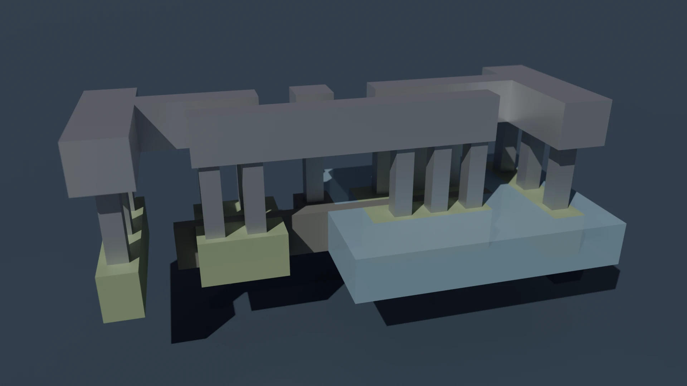
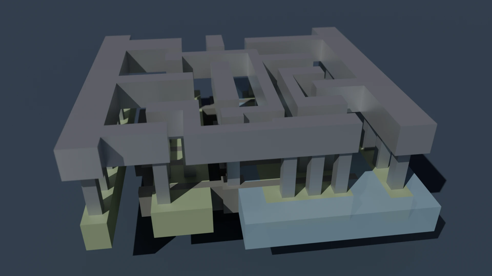
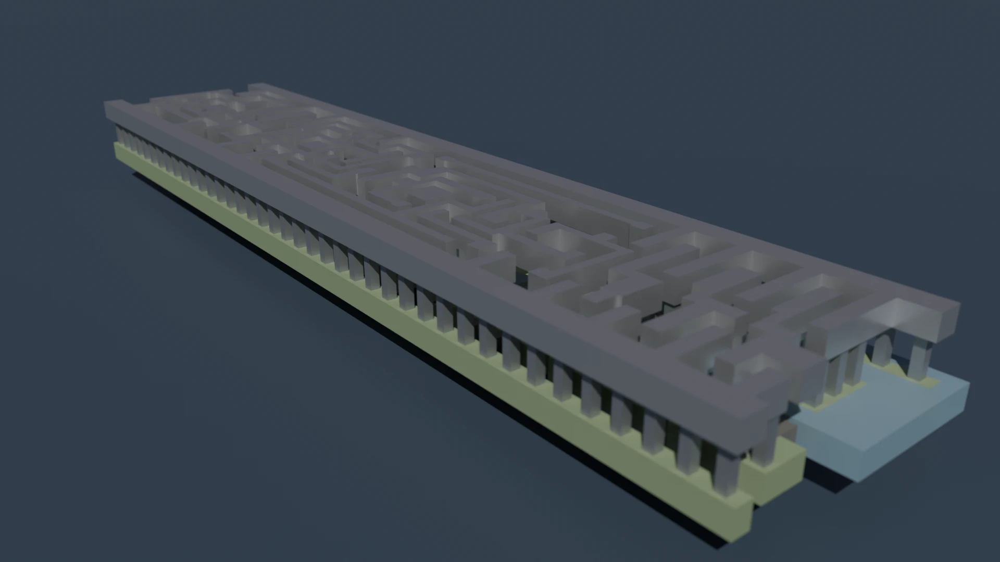

<!--
SPDX-FileCopyrightText: 2026 aesc-silicon

SPDX-License-Identifier: Apache-2.0
-->

# BlenderGDS Standard Cells

Pre-extracted GDS files for all IHP SG13G2 standard cells, ready for direct import into [BlenderGDS](https://github.com/aesc-silicon/BlenderGDS).

## Overview

The IHP SG13G2 standard cell library ships as a single monolithic GDS file containing all cells. This repository provides each cell as its own individual GDS file so they can be imported directly into BlenderGDS without any preprocessing.

84 cells are included, covering:

- **Combinational logic**: AND, OR, NAND, NOR, XOR, XNOR, INV, BUF (multiple drive strengths)
- **Complex gates**: AOI, OAI, MUX2, MUX4
- **Sequential**: D flip-flops, scan flip-flops, latches
- **Utility**: fill cells, decap cells, tie-hi/lo, antenna, delay gates, signal-hold

All cells are named with the `sg13g2_` prefix and a drive-strength suffix (e.g. `sg13g2_and2_1.gds`, `sg13g2_inv_4.gds`).

## Usage

1. Install [BlenderGDS](https://github.com/aesc-silicon/BlenderGDS) and enable it in Blender.
2. Go to **File → Import → GDSII (.gds)**.
3. Select the **IHP Open PDK SG13G2** as the PDK.
4. Browse to any file in `ihp-sg13g2/` and click **Import GDSII**.

## Gallery

### Inverter (`sg13g2_inv_1`)

The smallest cell in the library - a single-stage inverter at minimum drive strength.

### 2-Input XOR Gate (`sg13g2_xor2_1`)

A 2-input XOR gate. More complex internally than basic AND/OR/NAND/NOR cells due to the transistor arrangement needed to implement exclusive-or.

### Scan D Flip-Flop with Reset (`sg13g2_sbfrbp_2`)

A sequential scan flip-flop with reset, drive strength 2. Sequential cells are significantly larger than combinational gates and feature dense multi-layer metal routing.

## License

Apache License 2.0. See the `LICENSES/` directory for details.
